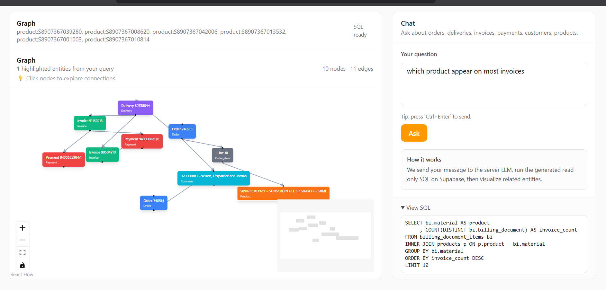

# Context Graph System with LLM-Powered Query Interface

## Overview

This project implements a context graph system over business data, enabling users to explore relationships between entities using natural language queries.

The system models structured data from an Order-to-Cash workflow as a graph of interconnected entities and provides an interface to query and visualize these relationships dynamically.

---

## Problem Statement

In real-world systems, data is often distributed across multiple tables such as orders, deliveries, invoices, and payments. While relational databases store these effectively, they do not provide an intuitive way to explore how entities are connected.

This project addresses that limitation by transforming relational data into a graph representation and enabling users to query it using natural language.

---

## Core Concept

The system represents business data as a graph where:

- Nodes represent entities such as orders, deliveries, invoices, payments, customers, and products.
- Edges represent relationships such as fulfillment, billing, and payment.

The primary flow modeled is:

Product → Order → Delivery → Invoice → Payment

---

## Features

- Graph-based visualization of business entities and relationships  
- Natural language query interface powered by an LLM  
- Dynamic SQL generation and execution on a relational database  
- Interactive exploration of entity connections  
- Contextual graph rendering (limited to local neighborhood for clarity)  
- Guardrails to restrict queries to the dataset  

---

## System Architecture

1. The user submits a natural language query.  
2. The query is processed by an LLM to generate a SQL statement.  
3. The SQL query is executed on a Supabase (Postgres) database.  
4. The result set is converted into graph nodes.  
5. Additional relationships are fetched to construct edges.  
6. The graph is rendered and relevant entities are highlighted.  

---

## Technology Stack

- Frontend: Next.js (App Router), ReactFlow  
- Backend: Node.js API routes  
- Database: Supabase (Postgres)  
- LLM Integration: OpenRouter / Gemini  
- Visualization: Graph-based UI  

---

## Setup Instructions

### 1. Clone the repository

```bash
git clone https://github.com/YOUR_USERNAME/YOUR_REPO.git
cd YOUR_REPO